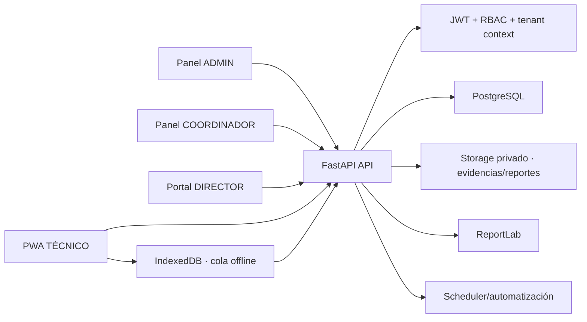
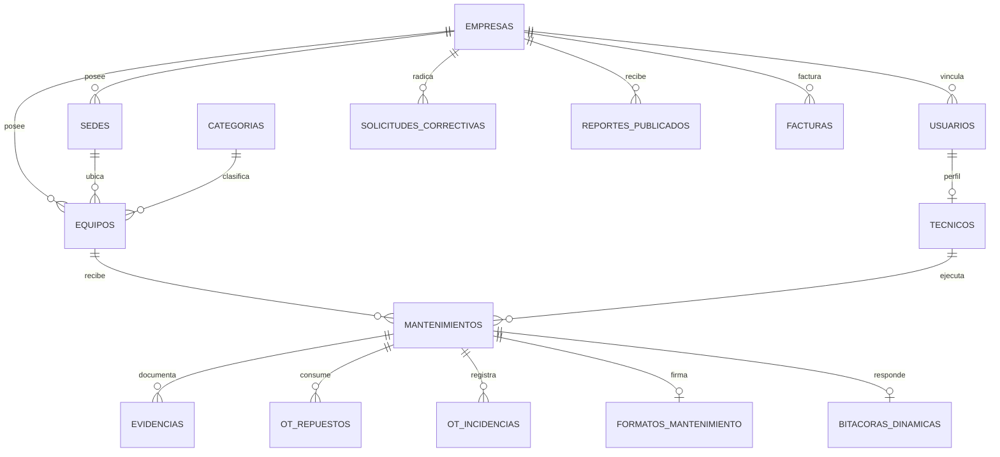

# Arquitectura de referencia — SGA SaaS GMAO/CMMS

## 1. Estado y alcance

SGA SaaS es una aplicación web responsive/PWA para administrar empresas, sedes, activos y órdenes de trabajo preventivas y correctivas. El repositorio usa:

- Frontend: React 19, Vite 8, React Router, Axios, Recharts y Lucide.
- Backend: FastAPI, Pydantic 2 y SQLAlchemy 2 síncrono.
- Datos: PostgreSQL y Alembic.
- Documentos: ReportLab y almacenamiento privado local, sustituible por S3/MinIO.
- Operación offline: Service Worker, Cache Storage e IndexedDB.

Los cuatro roles funcionales son `ADMIN`, `COORDINADOR`, `EMPRESA` y `TECNICO`. `CLIENTE` se admite únicamente como alias histórico de `EMPRESA`; no debe crearse en instalaciones nuevas.

## 2. Arquitectura lógica



Se recomienda mantener un monolito modular mientras el volumen no justifique servicios independientes. Los límites de dominio son: identidad, tenants, activos, OTs, ejecución técnica, evidencias, reportes, solicitudes correctivas, facturación y analítica.

## 3. Aislamiento multi-tenant

### Controles implementados

1. El JWT identifica usuario, rol y `empresa_id`.
2. El director no elige el tenant efectivo: el backend compara la empresa solicitada con la empresa del token.
3. Coordinación filtra OTs, equipos, reportes, formatos y solicitudes por su empresa.
4. El técnico solo opera OTs asignadas a su perfil técnico autenticado; un `usuario_id` enviado por formulario no permite suplantación.
5. Las evidencias se autorizan por OT/tenant y se entregan mediante URLs HMAC de cinco minutos.
6. Los reportes se descargan autenticados y el director solo ve estados `APROBADO` o `PUBLICADO`.
7. Los routers administrativos se montan con una dependencia global `ADMIN`.
8. Las claves foráneas y los índices conservan `empresa_id` en las entidades operativas nuevas.

### Defensa adicional implementada: PostgreSQL RLS

La migración `g37c5e080001` activa y fuerza RLS sobre empresas, sedes,
equipos, OTs y sus entidades descendientes. La revisión `h48d6f190001`
permite registrar eventos globales previos a la autenticación sin conceder
lectura global. El despliegue separa:

- `sga_owner`: propietario, usado solo por migraciones.
- `sga_app`: sin `BYPASSRLS`, usado por FastAPI.
- `sga_jobs`: rol controlado para procesos internos multi-tenant.

Cada transacción de aplicación debe ejecutar:

```sql
SELECT set_config('app.current_tenant', :empresa_id, true);
SELECT set_config('app.is_platform_admin', :is_admin, true);
```

Política modelo:

```sql
ALTER TABLE mantenimientos ENABLE ROW LEVEL SECURITY;
ALTER TABLE mantenimientos FORCE ROW LEVEL SECURITY;

CREATE POLICY mantenimientos_tenant ON mantenimientos
USING (
  current_setting('app.is_platform_admin', true) = 'true'
  OR empresa_id = nullif(current_setting('app.current_tenant', true), '')::uuid
)
WITH CHECK (
  current_setting('app.is_platform_admin', true) = 'true'
  OR empresa_id = nullif(current_setting('app.current_tenant', true), '')::uuid
);
```

`app.database.establecer_contexto_tenant` fija esas variables después de
autenticar y un evento SQLAlchemy las restaura tras cada `commit`. FastAPI usa
`sga_app`, creado por `backend/sql/provision_app_role.sql`, con
`NOBYPASSRLS`; Alembic usa exclusivamente `MIGRATION_DATABASE_URL`.

## 4. Modelo relacional



### Entidades principales

| Entidad | Propósito | Claves/controles principales |
|---|---|---|
| `empresas` | Tenant cliente | UUID, estado lógico |
| `sedes` | Ubicaciones físicas | `empresa_id NOT NULL` |
| `usuarios` | Identidad y rol | rol cerrado, `empresa_id` obligatorio salvo ADMIN |
| `tecnicos` | Perfil operativo | vínculo único con usuario |
| `categorias` | Cuatro familias canónicas | `code UNIQUE NOT NULL` |
| `equipos` | Inventario de activos | empresa, sede y categoría obligatorias |
| `mantenimientos` | Orden de trabajo | empresa, sede, equipo, técnico, tipo, estado y fechas |
| `evidencias` | Fotos Antes/Durante/Después | OT, equipo y clave privada de storage |
| `ot_repuestos` | Consumos de la OT | tenant, cantidad, unidad y costo |
| `ot_incidencias` | Hallazgos de la OT | tenant, tipo, severidad y resolución |
| `formatos_mantenimiento` | Formato y firmas PNG | una OT, firmas cliente/técnico |
| `solicitudes_correctivas` | Emergencias del director | tenant, sede, equipo, prioridad y estado |
| `reportes_publicados` | Borradores/PDF aprobados | tenant, storage privado y aprobación |
| `facturas` | Cartera por empresa | detalle JSON, valores Decimal y estados contables |

### Métricas del dashboard

Las métricas son derivadas, no fuente de verdad:

- Total equipos: conteo de `equipos` del tenant.
- OTs ejecutadas mes: `FINALIZADO` cuya finalización está en el mes.
- Pendientes: estados distintos de `FINALIZADO` y `ANULADO`.
- Cumplimiento preventivo: preventivas finalizadas / preventivas programadas no anuladas del mes.
- Retrasadas: no finalizadas, no anuladas y con fecha programada vencida.
- Preventivo/correctivo por sede: agregación por `sede_id`.

Para millones de OTs se recomienda una vista materializada diaria y refresco incremental; con el volumen actual las consultas tenant-scoped son suficientes.

## 5. PWA y sincronización

- El Service Worker almacena solo el shell; excluye `/api` y `/uploads`.
- IndexedDB conserva mutaciones y blobs fotográficos.
- Cada reintento incluye `X-Idempotency-Key`.
- La cola se procesa en orden al evento `online` o Background Sync.
- El técnico recibe un indicador global de operaciones pendientes.

Para una evolución futura se recomienda agregar `version` por entidad y respuestas HTTP 409 con estrategia explícita de conflicto.

## 6. Evidencias y documentos

- Evidencias: almacenamiento privado, MIME/tamaño validados, nombre aleatorio y URL firmada temporal.
- Reportes: almacenamiento privado y descarga JWT.
- Firmas: PNG base64 validado; no se acepta texto como firma.
- Producción: migrar `storage_key` a S3/MinIO, cifrado en reposo y lifecycle de retención.

## 7. Librerías de interfaz y gráficos

| Necesidad | Elección | Motivo |
|---|---|---|
| Gráficos ejecutivos | Recharts | Integración React, API declarativa, ya adoptada |
| Mapas | React Leaflet + OpenStreetMap | Sin dependencia de proveedor propietario |
| Tablas complejas | TanStack Table | Filtros, ordenamiento y virtualización |
| Formularios | React Hook Form + Zod | Validación tipada y mejor rendimiento |
| Datos remotos | TanStack Query | Caché, polling, reintentos e invalidación |
| Componentes accesibles | Radix UI / shadcn/ui | Primitivas accesibles y personalizables |
| Estado offline | IndexedDB; Dexie opcional | Persistencia de blobs y mutaciones |

Chart.js es válido, pero no aporta una ventaja frente a Recharts en este código. D3 debe reservarse para visualizaciones no cubiertas por componentes declarativos; usarlo para dona/barras aumentaría costo y complejidad.

## 8. Despliegue y migraciones

La cadena Alembic termina en `i59e7a2a0001`. La base local fue respaldada en
formato `pg_dump`, auditada y migrada desde una tabla `alembic_version` vacía
hasta la cabeza. Las dos tablas preexistentes de automatización se conservaron.
El estado verificado es:

1. `alembic current`: `i59e7a2a0001 (head)`.
2. Auditoría: 46 tablas de modelo, ninguna tabla ni columna requerida ausente.
3. Rol web: `sga_app`, `NOSUPERUSER`, `NOBYPASSRLS`.
4. Prueba PostgreSQL: dos tenants aislados y ADMIN con alcance global.
5. Suite backend: 50 pruebas correctas.
6. Suite frontend: 12 pruebas correctas para sesión, tenant, guardas RBAC y conectividad offline.

La revisión `i59e7a2a0001` incorporó a Alembic las tablas de configuración,
backups, SMTP, logs, monitor y scheduler. Se retiraron los `create_all()` del
arranque y de endpoints administrativos, de modo que FastAPI inicia sin DDL con
el rol restringido `sga_app`.

En otros ambientes se debe ejecutar primero
`scripts/audit_alembic_baseline.py`; nunca se debe hacer `stamp` basándose solo
en que algunas tablas ya existen.

## 9. Gates de producción

- Pruebas de integración reales con PostgreSQL y dos tenants: completado localmente.
- RLS con usuario no propietario: completado localmente.
- CORS limitado a dominios configurados: validado por configuración; producción rechaza `*`.
- Secretos fuera del árbol actual: completado; `backend/.env` es plantilla y `.env.local` está ignorado. La credencial histórica debe rotarse y purgarse antes de publicar el repositorio.
- Object storage privado y antivirus opcional.
- División del bundle por rutas: completado; entrada principal ~298 KB.
- ESLint: 0 errores y 0 advertencias.
- Auditoría npm: 0 vulnerabilidades conocidas después de actualizar dependencias compatibles.
- Observabilidad: métricas, trazas, errores y alertas.
- Prueba de restauración de backups: completada sobre `sga_restore_verify`; se recuperaron `alembic_version` y las dos tablas preexistentes y luego se eliminó la base temporal.
- Política de retención para evidencias, firmas, auditoría y facturas.
